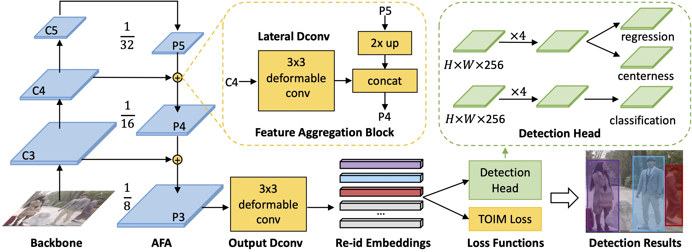

## Introduction

This is the implementation for [Anchor-Free Person Search](https://arxiv.org/abs/2103.11617) in CVPR2021.

A brief introduction in Chinese can be found at https://zhuanlan.zhihu.com/p/359617800




## License

This project is released under the [Apache 2.0 license](LICENSE).


## Installation

This project is developed upon [MMdetection](https://github.com/open-mmlab/mmdetection), please refer to [install.md](docs/install.md) to install MMdetection.

We utilized mmcv=1.1.5, pytorch=1.7.0


## Dataset

Download [CUHK-SYSU](https://github.com/ShuangLI59/person_search) and [PRW](https://github.com/liangzheng06/PRW-baseline).

We provide coco-style annotation in [demo/anno](demo/anno).

For CUHK-SYSU, change the path of your dataset and the annotaion file in the [config file](configs/_base_/datasets/cuhk_detection_1000.py) L3, L38, L43, L48

For PRW, change the paths in these config files: [config1](configs/fcos/prw_base_focal_labelnorm_sub_ldcn_fg15_wd1-3.py) [config2](configs/fcos/prw_dcn_base_focal_labelnorm_sub_ldcn_fg15_wd7-4.py)


## Experiments
  1. Train

   ```bash
   sh run_train.sh
   ```
  2. Test CUHK-SYSU

  Change the paths in L59 and L72 in [test_results.py](tools/test_results.py)

   ```bash
   sh run_test.sh
   ```
   3. Test PRW

   Change the paths in L127 and L128 in [test_results_prw.py](tools/test_results_prw.py)

   ```bash
   sh run_test_prw.sh
   ```

## Performance

|Dataset|Model|mAP|Rank1| Config | Link |
|-----|-----|------|-----|------|-----|
|CUHK-SYSU|AlignPS| 93.1%|93.4%|[cfg](https://github.com/daodaofr/AlignPS/blob/master/configs/fcos/fcos_center-normbbox-centeronreg-giou_r50_caffe_fpn_gn-head_dcn_4x4_1x_cuhk_reid_1500_stage1_fpncat_dcn_epoch24_multiscale_focal_x4_bg-2_lconv3dcn_sub_triqueue_dcn0.py)| [model](https://drive.google.com/file/d/1WMvvxee15Enca_l9DYzCuOfP1f64zliy/view?usp=sharing)| 
|CUHK-SYSU|AlignPS+|94.0%|94.5%|[cfg](https://github.com/daodaofr/AlignPS/blob/master/configs/fcos/fcos_center-normbbox-centeronreg-giou_r50_caffe_fpn_gn-head_dcn_4x4_1x_cuhk_reid_1500_stage1_fpncat_dcn_epoch24_multiscale_focal_x4_bg-2_lconv3dcn_sub_triqueue.py)| [model](https://drive.google.com/file/d/12AuG37IPkhyrpHG_kqpUzzoDEEkXlgne/view?usp=sharing)| 
|PRW|AlignPS| 45.9%|81.9%|[cfg](https://github.com/daodaofr/AlignPS/blob/master/configs/fcos/prw_base_focal_labelnorm_sub_ldcn_fg15_wd1-3.py)| [model](https://drive.google.com/file/d/1QQNoYQTiO3FIiEpu0AtigGFIDf3wG2u5/view?usp=sharing)| 
|PRW|AlignPS+|46.1%|82.1%|[cfg](https://github.com/daodaofr/AlignPS/blob/master/configs/fcos/prw_dcn_base_focal_labelnorm_sub_ldcn_fg15_wd7-4.py)| [model](https://drive.google.com/file/d/1O02EBrHglE1x-zk88QLLdXF-x6yebwBp/view?usp=sharing)| 


## Citation

If you use this toolbox or benchmark in your research, please cite this project.

```
@inproceedings{yan2021alignps,
  title={Anchor-Free Person Search},
  author={Yichao Yan, Jingpeng Li, Jie Qin, Song Bai, Shengcai Liao, Li Liu, Fan Zhu, Ling Shao},
  booktitle={CVPR},
  year={2021}
}
```

